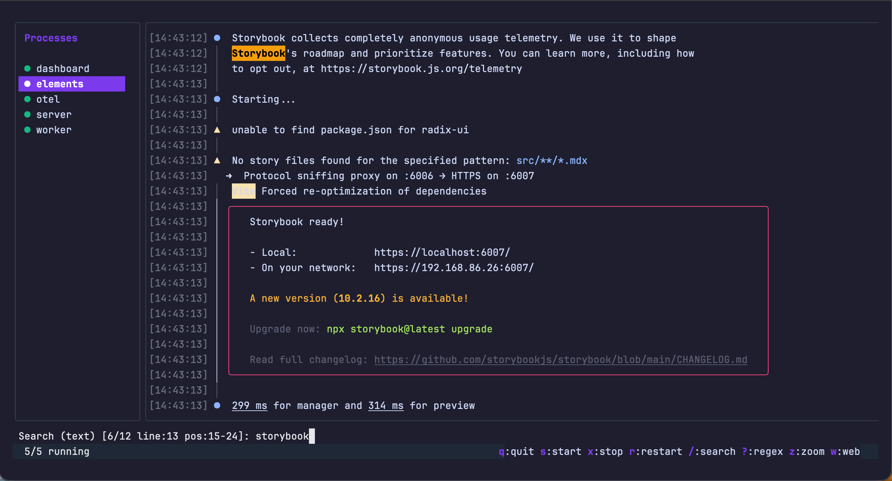

# madprocs

A drop-in replacement for [mprocs](https://github.com/pvolok/mprocs) with searchable logs.



## Features

- **mprocs-compatible** - Uses the same `mprocs.yaml` config format
- **Searchable logs** - The key missing feature from mprocs
  - Substring search (`/`)
  - Regex search (`?`)
- **PTY support** - Full terminal emulation for processes
- **Web UI** - Browser-based log viewer (press `w` to open)
- **Auto-scroll** - Follows new output, pauses when you scroll up
- **Mouse scroll** - Scroll logs with mouse wheel
- **Copyable logs** - Hold Shift to select text and click URLs (bypasses mouse capture)

## Installation

```bash
# Using go install
go install github.com/speakeasy-api/madprocs@latest

# Using mise
mise use -g github:speakeasy-api/madprocs@latest
```

Or download a binary from the [releases page](https://github.com/speakeasy-api/madprocs/releases).

## Usage

```bash
# Use mprocs.yaml in current directory
madprocs

# Specify a config file
madprocs -c myconfig.yaml

# Change web UI port and host
madprocs --port 8080 --host 0.0.0.0

# Run web UI only (headless mode)
madprocs --web-only

# Enable TLS for web UI
madprocs --tls-cert cert.pem --tls-key key.pem

# Write logs to files
madprocs --log-dir ./logs
```

## Configuration

madprocs uses the same config format as mprocs. Create an `mprocs.yaml`:

```yaml
procs:
  server:
    cmd: ["npm", "run", "dev"]
    cwd: ./server

  client:
    cmd: ["npm", "start"]
    cwd: ./client
    env:
      PORT: "3001"

  worker:
    shell: "python worker.py --verbose"
```

Environment variables are expanded in config values using `$VAR` or `${VAR}` syntax:

```yaml
procs:
  api:
    shell: "go run . --port $API_PORT"
    env:
      DATABASE_URL: "${DB_HOST}:${DB_PORT}"
```

## Keyboard Shortcuts

| Key | Action |
|-----|--------|
| `q` | Quit |
| `j/k` or `↑/↓` | Navigate process list |
| `Tab` | Switch between list and logs |
| `s` | Start selected process |
| `x` | Stop selected process |
| `r` | Restart selected process |
| `/` | Search (substring) |
| `?` | Search (regex) |
| `n/N` | Next/previous match |
| `Enter` | Next match (in search mode) |
| `Esc` | Exit search mode |
| `z` | Zoom (toggle fullscreen logs) |
| `w` | Open web UI |

## Web UI

Press `w` to open the web UI in your browser, or access it at the URL shown in the status bar:
- Full log history with ANSI color support
- Search and filtering
- Process control (start/stop/restart)
- Log download

## Why madprocs?

mprocs is great, but lacks log search functionality. When debugging across multiple services, being able to search logs is essential. madprocs adds this while maintaining full compatibility with mprocs configs.

## License

MIT
